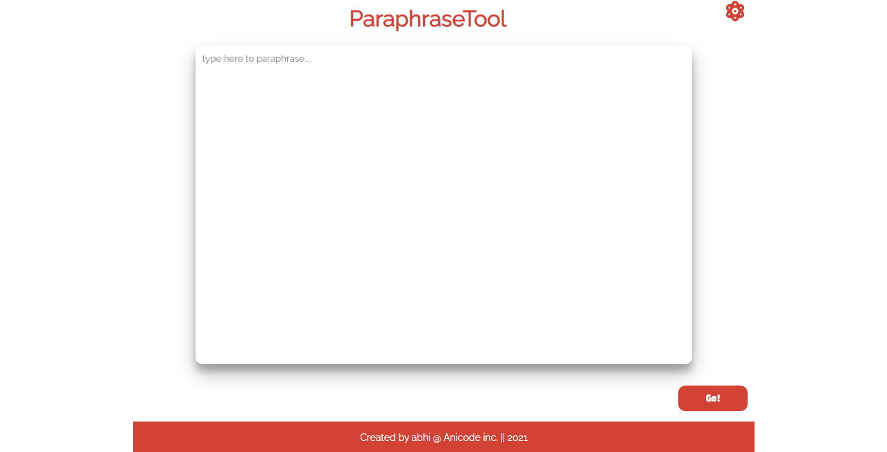
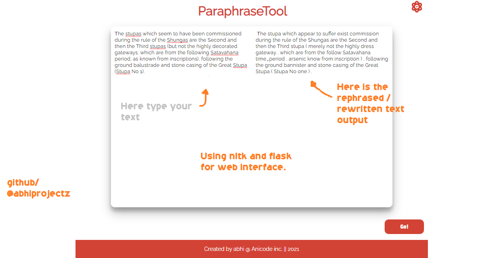

# PhraseItUp
<<<<<<< HEAD
PhraseItUp is an NLP based text paraphraser built using Python and Flask.
=======

PhraseItUp is an NLP based text paraphraser built using Python and Flask.

This tool can re write your text content using NLTK and some basic approaches to paraphrase text such as:

+ Changing synonyms or similar words.
+ Usage of passive or active voices somewhere.
+ Semantic changes etc.

# Introduction

This is how the web interface looks like.

Ever thought to rewrite your text effectively ?
Best for content writter but is in experimental phase.

At right side just type your text should be less than 1500 words for better results.
and at the right side you get the output that is rePhrased text.

Watch the live testing here:

[assets/testing.mp4](assets/testing.mp4)

# Tech used:

+ Flask (For web interface)
+ Nltk [NLP (Natural language processing) approaches]

# Explore my more projects

Github: [@abhiprojectz](https:/github.com/abhiprojectz)

>>>>>>> a0d7a68... adding files
